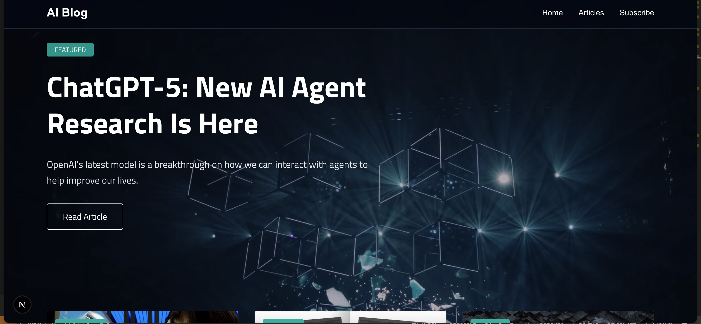

# AI Blog

A modern, responsive blog website built with Next.js and Tailwind CSS, focusing on artificial intelligence and machine learning content.



## Features

- 🎨 Modern and responsive design
- 📱 Mobile-friendly interface
- 🚀 Built with Next.js 14
- 💅 Styled with Tailwind CSS
- 📝 Featured article section
- 📚 Blog post grid layout
- 📧 Newsletter subscription form
- 🔗 Social media integration
- 🌙 Dark mode optimized

## Tech Stack

- [Next.js](https://nextjs.org/) - React framework for production
- [TypeScript](https://www.typescriptlang.org/) - Type-safe JavaScript
- [Tailwind CSS](https://tailwindcss.com/) - Utility-first CSS framework
- [Lucide Icons](https://lucide.dev/) - Beautiful and consistent icons
- [Google Fonts](https://fonts.google.com/) - Custom typography


## Project Structure

```
ai-blog/
├── app/
│   ├── components/     # React components
│   ├── data/          # Data files
│   ├── types/         # TypeScript types
│   └── page.tsx       # Main page component
├── public/            # Static assets
└── ...config files
```

## Components

- `FeaturedArticle` - Hero section with featured blog post
- `BlogPostCard` - Individual blog post card component
- `SubscribeForm` - Newsletter subscription form
- `Footer` - Site footer with navigation and social links

## Contributing

Contributions are welcome! Please feel free to submit a Pull Request.

1. Fork the repository
2. Create your feature branch (`git checkout -b feature/amazing-feature`)
3. Commit your changes (`git commit -m 'Add some amazing feature'`)
4. Push to the branch (`git push origin feature/amazing-feature`)
5. Open a Pull Request

## License

This project is licensed under the MIT License - see the [LICENSE](LICENSE) file for details.

## Acknowledgments

- [Next.js Documentation](https://nextjs.org/docs)
- [Tailwind CSS Documentation](https://tailwindcss.com/docs)
- [Unsplash](https://unsplash.com/) for the beautiful images

## Contact

Your Name - [@yourtwitter](https://twitter.com/yourtwitter)

Project Link: [https://github.com/yourusername/ai-blog](https://github.com/yourusername/ai-blog)
